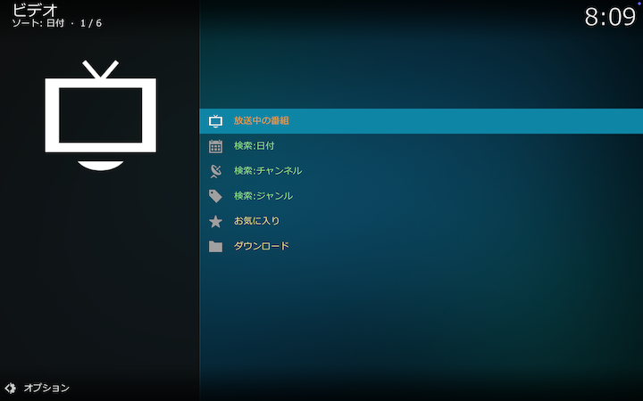
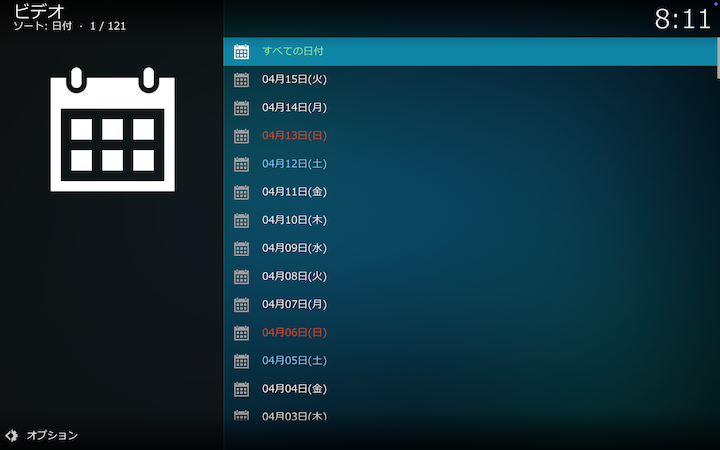
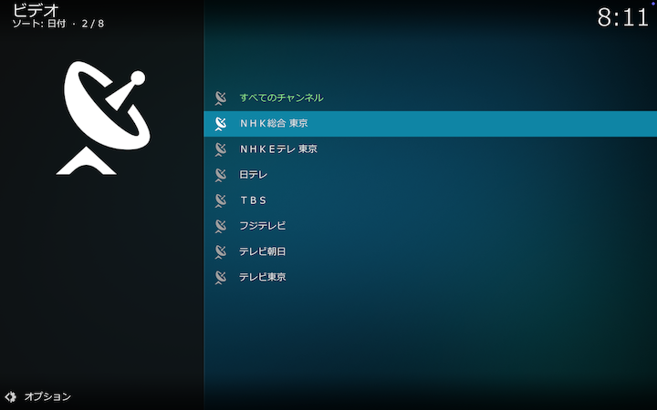
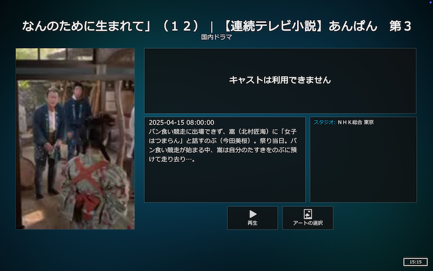
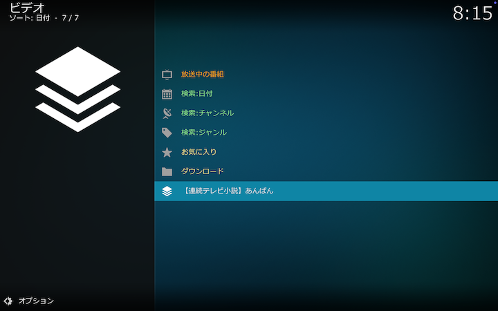
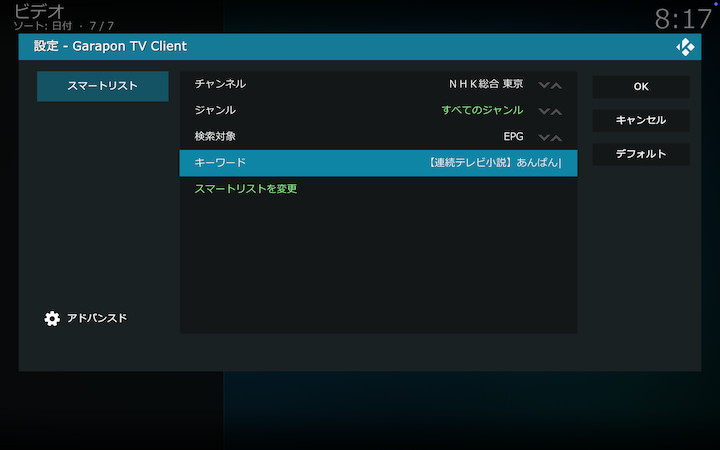
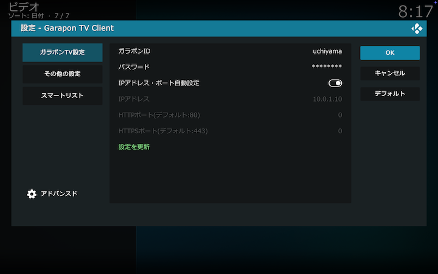
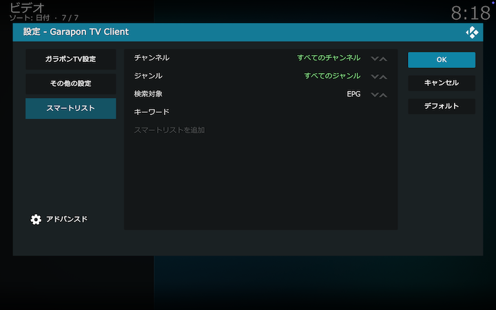

## Kodiアドオン：ガラポンTVクライアント

[ガラポンTV](https://garapon.tv)を操作するためのKodiアドオンです。

 

## 目次

[初回起動時の設定](#初回起動時の設定)

[トップ画面と検索](#トップ画面と検索)

[番組のコンテクストメニュー操作](#番組のコンテクストメニュー操作)

[スマートリストの編集](#スマートリストの編集)

[アドオン設定画面-ガラポンTV設定](#アドオン設定画面-ガラポンTV設定)

[アドオン設定画面-その他の設定](#アドオン設定画面-その他の設定)

[アドオン設定画面-スマートリスト](#アドオン設定画面-スマートリスト)

 

## 初回起動時の設定

初回起動時にはアドオン設定画面が表示されます。

ガラポンIDおよびパスワードを入力して「設定を更新」を選択してください（「OK」を選択しても設定は更新されません）。

あとは自動的に、入力したガラポンIDとパスワードでガラポンWeb認証を行い、ガラポンTV端末のIPアドレスを取得、さらに、取得したIPアドレスに対して、ガラポンTV端末が対応する放送局情報をリクエストし、アドオンの情報を更新します。

以上で初期設定は完了です。

 

## トップ画面と検索

初回起動時の設定が完了すると、トップ画面が表示されます。

### 放送中の番組

現在放送中の番組のリストが表示されます。

ここで見たい番組を選択すると、番組が再生されます（Kodiの設定によっては番組の詳細情報が表示されます）。

### 検索：日付

ガラポンTV端末に録画されている番組を検索します。
日付→チャンネル→ジャンルの順に検索条件を設定します。まず、日付を選択します。

次にチャンネルを選択します。

次にジャンルを選択します。

次にサブジャンルを選択します。選択後、検索が実行されます。

検索結果が表示されます。

ここで見たい番組を選択すると、番組が再生されます（Kodiの設定によっては番組の詳細情報が表示されます）。

### 検索：チャンネル

検索条件を、チャンネル→ジャンル→日付の順に設定するほかは「検索：日付」と同様です。

### 検索：ジャンル

検索条件を、ジャンル→チャンネル→日付の順に設定するほかは「検索：日付」と同様です。

### お気に入り

ガラポンTV端末に「お気に入り」として録画されている番組を表示します。

 

## 番組のコンテクストメニュー操作

番組を選択した状態でコンテクストメニューを表示し、その番組に関する操作を行うことができます。

### 詳細情報

選択されている番組の詳細情報を表示します。

### スマートリストに追加

選択されている番組の番組情報に基づいて、スマートリストの編集画面を表示します。
スマートリストとは、帯番組の検索などをワンクリックで実行するために、チャンネル、ジャンル、キーワードなどの検索条件をまとめて保存するものです。

キーワード等を編集します。

「スマートリストを追加」を選択して追加操作は完了です。スマートリストがトップ画面に追加されます。

追加されたスマートリストを選択すると、設定したチャンネル、ジャンル、キーワードなどにマッチする番組が検索結果として表示されます。

### お気に入りに追加

選択されている番組をガラポンTV端末の「お気に入り」に追加します。

### お気に入りから削除

選択中の番組が、すでに「お気に入り」に追加されている場合は、「お気に入りに追加」の代わりに「お気に入りから削除」がコンテクストメニューに表示されます。
これを選択すると、選択されている番組がガラポンTV端末の「お気に入り」から削除されます。

 

## スマートリストの編集

スマートリストを選択した状態でコンテクストメニューを表示し、そのスマートリストの編集、削除を行うことができます。

### スマートリストを編集

スマートリスト編集画面が表示されます。

編集した後、「スマートリストを変更」を選択してください。

### スマートリストを削除

選択されたスマートリストが削除されます。

 

## アドオン設定画面-ガラポンTV設定

### ガラポンID

ガラポンTV端末にアクセスするためのIDです。

### パスワード

ガラポンTV端末にアクセスするためのパスワードです。

### IPアドレス・ポート自動設定

通常はこれをチェックしてください。IPアドレス等は、ガラポンWeb認証によって自動的に取得されます。

### IPアドレス

ガラポンTV端末のIPアドレスです。

### HTTPポート

ガラポンTV端末のHTTPポートです。

### HTTPSポート

ガラポンTV端末のHTTPSポートです。

### 設定を更新

設定を変更した場合に選択してください。

 

## アドオン設定画面-その他の設定

### サムネイルキャッシュをクリア

アドオンが生成した番組のサムネイルの容量が表示されます。必要に応じてクリアしてください。

### セッションIDを更新

セッションIDは自動的に管理されますので、通常この機能を使用することはありません。

### チャンネルリストを更新

チャンネルリストは自動的に管理されますので、通常この機能を使用することはありません。

 

## アドオン設定画面-スマートリスト

スマートリストの編集画面です。スマートリストとは、帯番組の検索などをワンクリックで実行するために、チャンネル、ジャンル、キーワードなどの検索条件をまとめて保存するものです。

チャンネル、ジャンル、検索対象、キーワードを設定して「スマートリストを追加する」を選択してください。
テレビリモコンで操作する場合は日本語入力ができないので、[番組のコンテクストメニュー操作](#番組のコンテクストメニュー操作)に記載した、番組情報に基づいてスマートリストを編集する方法がおすすめです。

